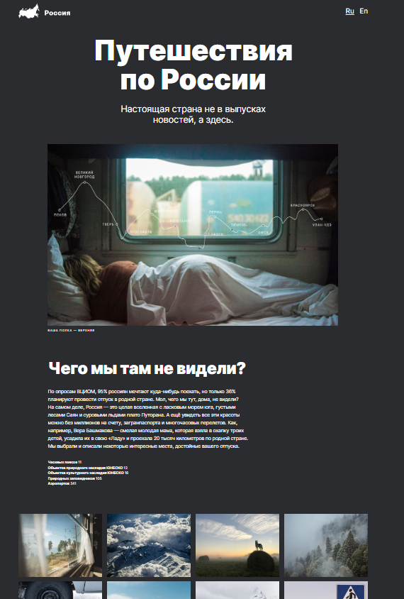

# Путешествия по России

[Ссылка на GitHub Pages](https://yaroslav-chertov.github.io/russian-travel/)

[Ссылка на макет Figma](https://www.figma.com/file/5S2WSbEFL6awjVWJ0NWL8Q/Sprint-3_-Russia-_-desktop-mobile?node-id=28503%3A0)

## Описание и функциональность
Одностраничный адаптивный сайт о путешествии по России с упоминанием интересных географических мест.



Функционал:
* Адаптивный верстка для экранов популярных разрешений;
* Расширинный функционал Html и CSS.

Технологии:
* Grid Layout;
* Flexbox;
* БЭМ методология, файловая структура (Nested);
* Подключение стороннего шрифта.

Выводы:
* После изучения технологий лучше разобрался в особенностях работы с гридами и флексами, наработал удобные шаблоны сетки на будущее.

## Инструкция по установке: 

```
git clone https://github.com/Yaroslav-Chertov/russian-travel.git
``` 
Затем запустить локальный сервер.
